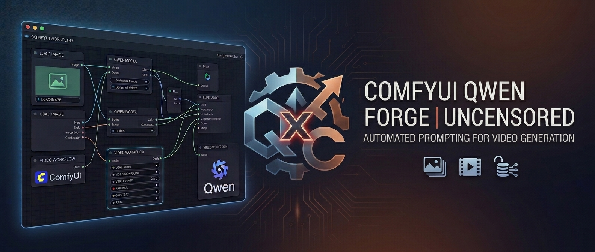

# ComfyUI-Qwen-Forge-Uncensored



A clean, modular ComfyUI node pack for generating uncensored multimodal and text prompts with Qwen, designed specifically for AI video-generation workflows.

## Features

- **Pluggable backends**: HuggingFace Transformers and GGUF (llama.cpp) out of the box; vLLM and MLX stubs ready for future support.
- **Multimodal and text-only nodes** for video/animation prompt generation.
- **Grouped system prompt presets** for MiniMax H3, Wan 2.2, LTX and generic image/video analysis.
- **Smart prompt cache**, VRAM cleanup, and `keep_model_loaded` support.
- **Qwen3.x family detection** with automatic thinking disabled.

## Installation

```bash
cd ComfyUI/custom_nodes
git clone https://github.com/huchukato/ComfyUI-Qwen-Forge-Uncensored.git
```

Install dependencies (if not already present):

```bash
cd ComfyUI-Qwen-Forge-Uncensored
pip install -r requirements.txt
```

For GGUF vision support, install a vision-capable `llama-cpp-python` wheel for your platform.

## Nodes

| Node | Backend | Purpose |
|------|---------|---------|
| `Qwen-Uncensored Vision` | HF Transformers | Multimodal inference (image/video) |
| `Qwen-Uncensored Vision (Advanced)` | HF Transformers | Multimodal with full parameter control |
| `Qwen-Uncensored Vision (GGUF)` | GGUF | Multimodal inference via llama.cpp |
| `Qwen-Uncensored Vision GGUF (Advanced)` | GGUF | Multimodal GGUF with full parameters |
| `Qwen-Uncensored Text` | HF Transformers | Prompt enhancement / text-only |
| `Qwen-Uncensored Text (GGUF)` | GGUF | Prompt enhancement / text-only via llama.cpp |
| `Qwen Uncensored - VRAM Cleanup` | Utility | Pass-through VRAM cache cleanup and model unloading |
| `Qwen Uncensored - Story Split` | Utility | Split a story into four separate prompts |

## Configuration

- `models.json` — catalog of supported HF and GGUF models.
- `system_prompts.json` — vision presets and text styles.
- `custom_models.json` — optional user overrides (not tracked by git).

HF models are downloaded into `models/LLM/Qwen-Forge`; local models in `models/LLM/Qwen-Forge` and `models/LLM/GGUF` are discovered automatically.

## License

GPL-3.0 — see [LICENSE](LICENSE).
